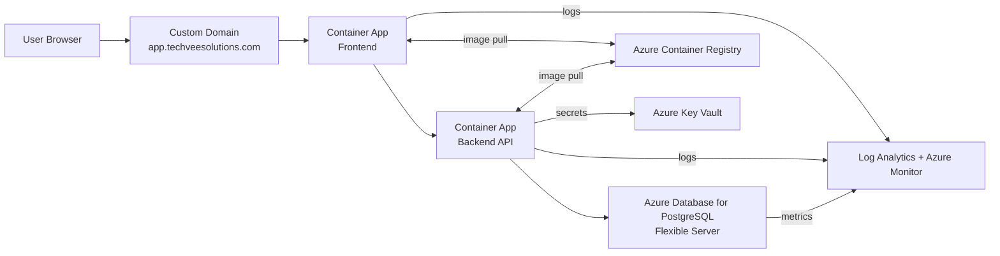

# Azure Architecture Diagram

This diagram shows the end-to-end Azure deployment for the Task Management Application.

## Key Components

- **Container Apps**: Host frontend and backend services.
- **PostgreSQL Flexible Server**: Managed database.
- **ACR**: Stores backend and frontend images.
- **Key Vault**: Centralized secrets store.
- **Azure Monitor/Log Analytics**: Logs and metrics.

## Notes

- Container Apps use VNet integration for backend-to-database access.
- Public access is via custom domain with HTTPS.
