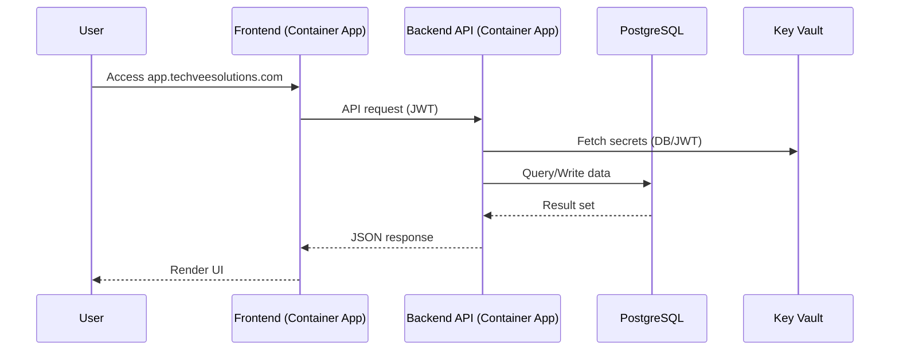

# Data Flow Diagram

```mermaid
sequenceDiagram
  participant U as User
  participant F as Frontend (Container App)
  participant B as Backend API (Container App)
  participant D as PostgreSQL
  participant KV as Key Vault

  U->>F: Access app.techveesolutions.com
  F->>B: API request (JWT)
  B->>KV: Fetch secrets (DB/JWT)
  B->>D: Query/Write data
  D-->>B: Result set
  B-->>F: JSON response
  F-->>U: Render UI
```

## Notes

- Secrets are retrieved from Key Vault on startup (or via environment injection).
- The frontend calls the backend API over HTTPS.
